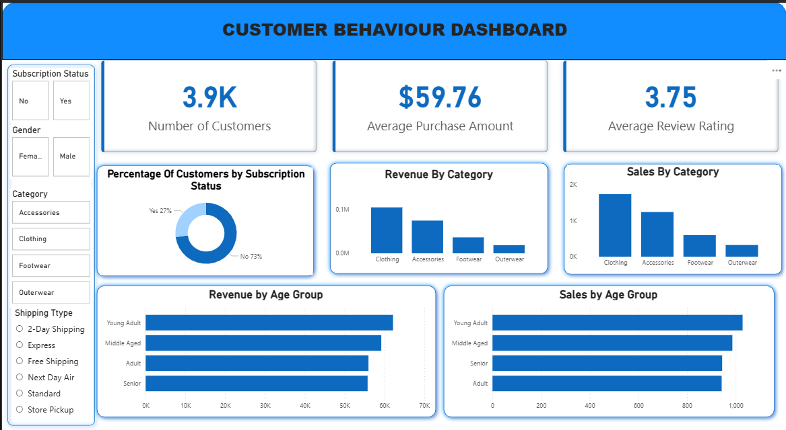

# Customer Shopping Behavior Analysis
Project Overview

This project analyzes customer shopping behavior using Python, PostgreSQL, SQL, and Power BI to uncover key purchasing patterns, customer segments, revenue drivers, and operational insights.

The project follows a complete data analytics workflow starting from data cleaning and preprocessing in Python, storing transformed data in PostgreSQL, performing analytical SQL queries, and building an interactive Power BI dashboard for business decision-making.

The analysis is based on approximately 3,900 customer transactions and focuses on customer demographics, subscription behavior, product performance, revenue generation, and delivery preferences.

Business Problem

Retail businesses generate large amounts of customer transaction data but often struggle to identify:

High-value customer segments
Revenue-generating product categories
Subscription program effectiveness
Discount dependency risks
Customer purchasing behavior patterns
Opportunities for customer retention and growth

This project aims to convert raw transactional data into actionable business insights.

Tools & Technologies Used
Programming & Data Processing
Python
Pandas
NumPy
Psycopg2
Database
PostgreSQL
SQL
Data Visualization
Power BI
Development Environment
VS Code
Jupyter Notebook
Project Workflow
1. Data Cleaning and Preparation (Python)
Imported customer shopping dataset
Handled missing values
Standardized column names using snake_case
Created age-group bins
Performed feature preparation for analysis
Loaded cleaned data into PostgreSQL database
2. Database Design (PostgreSQL)
Created relational database tables
Imported cleaned customer transaction data
Established SQL-ready analytical environment
3. SQL Analysis

Performed business-focused SQL queries to analyze:

Revenue by category
Sales by category
Revenue by age group
Subscription vs Non-subscription behavior
Discount utilization patterns
Product performance
Delivery preference analysis
Customer segmentation
4. Dashboard Development (Power BI)

Built an interactive dashboard containing:

Customer Count KPI
Average Purchase Amount KPI
Average Review Rating KPI
Subscription Distribution Analysis
Revenue by Category
Sales by Category
Revenue by Age Group
Sales by Age Group
Dynamic Filters and Slicers
Dashboard Overview
Key Performance Indicators
Metric	Value
Total Customers	3,900
Average Purchase Amount	$59.76
Average Review Rating	3.75
Key Insights

Subscription Program Analysis
Subscribers: 1,053 customers
Non-Subscribers: 2,847 customers
Non-subscribers generated the majority of revenue.
Average spending between subscribers and non-subscribers remained nearly identical, indicating subscriptions increased engagement rather than purchase value.

Revenue by Customer Demographics
Male customers contributed a larger share of revenue.
Opportunity exists to improve acquisition among female customer segments.

Discount Dependency
839 high-value customers relied on promotional discounts.
Products such as Hats, Sneakers, Coats, Sweaters, and Pants showed high discount dependency, creating potential margin risks.

Shipping Behavior
Customers choosing Express Shipping spent approximately 3.46% more per order than standard shipping customers.

Age Group Analysis
Revenue distribution remained relatively balanced across age groups.
Young Adults generated the highest revenue contribution while Seniors generated the lowest, with only modest variation between groups.

Business Recommendations
Redesign subscription programs with exclusive member benefits.
Implement loyalty programs for returning customers.
Optimize discount strategies to protect profit margins.
Increase focus on top-performing product categories.
Target high-spending customer segments through personalized marketing campaigns.
Promote premium shipping options to increase average order value.

Repository Structure
Customer-Shopping-Behavior-Analysis/
│
├── Dataset/
│   └── customer_shopping_behavior.csv
│
├── Python/
│   └── customer_shopping.ipynb
│
├── SQL/
│   └── customer_behaviour.sql
│
├── Dashboard/
│   └── Customer_Shopping_behaviour.pbix
│
├── Images/
│   └── dashboard.png
│
├── Reports/
│   └── Customer Shopping Behavior Analysis.pdf
│
└── README.md
Results

This project demonstrates an end-to-end analytics workflow that combines:

Data Cleaning
Data Warehousing
SQL Analytics
Business Intelligence
Dashboard Development
Business Recommendation Generation

The outcome is a decision-support dashboard that enables stakeholders to understand customer behavior and identify revenue growth opportunities.

Author
Pranay Kumar
Aspiring Data Analyst skilled in:

SQL
PostgreSQL
Python
Power BI
Excel
Data Visualization
Business Analytics
